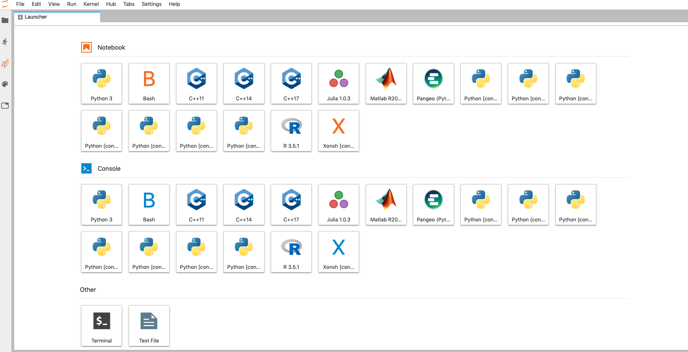

First Time Setup
-----------------

This tutorial covers the installation and setup of a Python environment on:

- Cheyenne/DAV 

Throughout this tutorial, we will be using miniconda which provides 
prepackaged Python environments with automated installers, the package manager ``conda``.

https://docs.conda.io/en/latest/miniconda.html

The following instructions are intended to be carried out on Cheyenne. Steps 1-3 can also be done on your laptop to install Python and associated environments there locally. 

0. Log in to the Cheyenne System
~~~~~~~~~~~~~~~~~~~~~~~~~~~~~~~~~~~

1. Clone NCAR Pangeo Tutorial Repository
~~~~~~~~~~~~~~~~~~~~~~~~~~~~~~~~~~~~~~~~~

Run the following commmand to clone this repo to your Cheyenne/Glade file space:

``git clone https://github.com/NCAR/NCAR-pangeo-tutorial``

.. code:: bash 

   abanihi@cheyenne2: ~/workdir $ git clone https://github.com/NCAR/NCAR-pangeo-tutorial
   Cloning into 'NCAR-pangeo-tutorial'...
   remote: Enumerating objects: 24, done.
   remote: Counting objects: 100% (24/24), done.
   remote: Compressing objects: 100% (20/20), done.
   remote: Total 586 (delta 12), reused 7 (delta 4), pack-reused 562
   Receiving objects: 100% (586/586), 17.34 MiB | 5.58 MiB/s, done.
   Resolving deltas: 100% (312/312), done.

2. Get miniconda and install
~~~~~~~~~~~~~~~~~~~~~~~~~~~~

Download miniconda with the following command: 

- ``wget https://repo.anaconda.com/miniconda/Miniconda3-latest-Linux-x86_64.sh -O miniconda.sh``

.. code:: bash
    
    abanihi@cheyenne2: ~/workdir $ cd NCAR-pangeo-tutorial/
    abanihi@cheyenne2: ~/workdir/NCAR-pangeo-tutorial $ wget https://repo.anaconda.com/miniconda/Miniconda3-latest-Linux-x86_64.sh -O miniconda.sh
   --2019-05-31 16:47:41--  https://repo.anaconda.com/miniconda/Miniconda3-latest-Linux-x86_64.sh
   Resolving repo.anaconda.com (repo.anaconda.com)... 104.16.131.3, 104.16.130.3, 2606:4700::6810:8303, ...
   Connecting to repo.anaconda.com (repo.anaconda.com)|104.16.131.3|:443... connected.
   HTTP request sent, awaiting response... 200 OK
   Length: 70348401 (67M) [application/x-sh]
   Saving to: ‘miniconda.sh’

   100%[======================================================================================================================================================================================================================================>] 70,348,401   137MB/s   in 0.5s

   2019-05-31 16:47:42 (137 MB/s) - ‘miniconda.sh’ saved [70348401/70348401]
   
- To install miniconda, run the following command and follow the prompts on the installer screen:
   
   ``chmod +x miniconda.sh && ./miniconda.sh``
   
   Or 
   
   ``bash miniconda.sh`` for bash users
   
   
.. code:: bash

    abanihi@cheyenne2: ~/workdir/NCAR-pangeo-tutorial $ bash miniconda.sh

      Welcome to Miniconda3 4.6.14

      In order to continue the installation process, please review the license
      agreement.
      Please, press ENTER to continue
      >>>
      

If you are unsure about any setting, accept the defaults. We recommend adding the miniconda path to your PATH variable manually. 

- For a ``bash user``, this would entail adding something like the following to your .bashrc file:

.. code:: bash
   
   export PATH=/path/to/installation/miniconda3/bin:${PATH}

- For ``csh/tcsh users``, add the following to your ``.tcshrc``:

.. code:: bash

    source /path/to/installation/miniconda3/etc/profile.d/conda.csh

since the more standard approach ``setenv PATH $PATH\:/path/to/installation/miniconda3`` for ``csh/tcsh`` doesn’t work for the time being.

.. NOTE::

``To make the changes take effect, logout and log back in.``

  
Once you are logged back in, change into the newly created NCAR-pangeo-tutorial directory

.. code:: bash 

   cd /path/to/NCAR-pangeo-tutorial

To verify that conda is available on your system, you can try

.. code:: bash 

   conda --version 

After Miniconda is installed, you will want to update and set up Conda so that it
installs packages from a trusted ``channel``.  Within the Python community,
the ``conda-forge`` channel is considered the most trusted source of packages
that will work together.  So, we enable the use of the ``conda-forge`` channel
for all packages with the following:

.. code:: bash

    conda config --add channels conda-forge
    conda update -n base conda

.. NOTE::
 
   The following step may not be necessary with more recent version of the miniconda script.

And configure the shell, replacing {SHELL} in the command below with your shell (i.e., bash, tcsh,...):

.. code:: bash

   conda init {SHELL}

3. Create environments
~~~~~~~~~~~~~~~~~~~~~~~~

Conda allows you to set up virtual Python environments for different projects, 
in which different versions of the required dependencies are installed.
With this approach, it is easy to maintain multiple environments with different configurations. 

First update the conda base environment.

.. code:: bash

  conda env update -f environments/env-conda-base.yml

Next create a new environment call "analysis" (this can take 10-15 min).

.. code:: bash

  conda env create -f environments/env-analysis.yml

Note that some version of CESM do not support Python 3, but support for Python 2 is going away. 
In case you need a Python 2 environment, you can create one as follows.

.. code:: bash

   conda env create -f environments/env-py2.yml

If you are interested in using Matlab in JupyterLab, consider creating the following environment.

.. code:: bash

  conda env create -f environments/env-py-matlab.yml

(Using Matlab requires building the Matlab Python API; see scripts/build-matlab-api.  Scripts are set up to use API's built in ``~/matlab-python`` or ``~mclong/matlab-python``.)

To use one of these environments, we need to activate it using the command ``conda activate ENV_NAME``, and to 
deactivate an environment, we use ``conda deactivate``. 

Once you've created the above environments, you will need to run the ``post_build``
script in order to build JupyterLab extensions.

.. code:: bash

  conda activate base
  ./environments/post_build

To manage environments, the ``conda env``, ``conda info``, and ``conda list`` commands
are helpful tools. The ``conda info`` command can be used to list available environments (same as ``conda env list``).

4. Copy configuration file:
~~~~~~~~~~~~~~~~~~~~~~~~~~~~

.. note::
   
   **The configuration file currently contains defaults that are appropriate for Cheyenne/DAV; don't do this step on the CGD machines!**

.. code:: bash

   ./config/copy_config

This adds a file to your home directory: ``~/.config/dask/jobqueue.yaml``.

Consider opening this file in a text editor and changing the lines specifying project number: remove the comment and add your preferred project number. 

5. Start Jupyter Lab
~~~~~~~~~~~~~~~~~~~~~

5.1. Cheyenne
++++++++++++++

To use the Cheyenne compute nodes, we recommend using JupyterLab via NCAR's JupyterHub deployment. 

Open your preferred browser (Chrome, Firefox, Safari, etc...) on your ``local machine``, and head over to ``https://jupyterhub.ucar.edu/ch``. Once this page is fully loaded, you will see a login screen:

- ``Login``

.. image:: assets/img/login.png
   :alt: JHUB-LOGIN
   :align: center

- ``Launch a Job``

Once you are successfully authenticated, you will be automatically redirected to a job spawning page that looks like this:

.. image:: assets/img/job.png
   :alt: JHUB-JOB
   :align: center

You can specify your project account, you can also change the queue and other settings.

When you are ready, click the ``Spawn`` button to submit your job.  When your job is up and running, you will see this page:

.. image:: assets/img/spawner.png
   :alt: JHUB-SPAWNER
   :align: center

When your Jupyter Lab server is up and running you will be redirected to a new page similar to:

Once your session is active, yu can start creating and using Jupyter notebooks:

- Create a new notebook: ``File ➤ New ➤ Notebook``

.. image:: https://i.imgur.com/pXpwUXC.png
   :alt: launch
   :align: center

- Select which kernel to use:

.. image:: https://i.imgur.com/q8LDBCj.png
   :alt: prompt
   :align: center

.. image:: https://i.imgur.com/zoGymUm.png
   :alt: select-kernel
   :align: center

Detailed info on using JupyterLab is 
available @ https://ncar-hackathons.github.io/jupyterlab-tutorial/notebook_need_to_know.html

5.2. DAV (Casper)
++++++++++++++++++++

Launching JupyterLab on DAV system is a bit different (there will be a JupyterHub deployment on the DAV system in the coming months (stay tuned)). 

For the time being, in order to run Jupyter Lab on the DAV system, you will need to use SSH tunneling scripts provided in ``scripts/jlab-dav``

- From one of Cheyenne's logging nodes, run the following command:

.. code:: bash

  cd scripts
  ./jlab-dav
  

These scripts print instructions for how to SSH into the machine with an SSH tunnel that enables connecting to the compute node where JupyterLab is running. 

Once you have made this SSH connection, open your preferred browser on your local machine and go to the address: localhost:8888 (or whichever port specified in the jlab script).

If you want to use Matlab, you must add a flag to enable the module load; for instance:

.. code:: bash

  cd scripts
  ./jlab-dav --matlab

5.3. Running JupyterLab Locally
+++++++++++++++++++++++++++++++++

For those interested in running JupyterLab on their local machine, after installing conda and creating a conda environment with required libraries including JupyterLab, you can simply run the following command, and follow the printed instructions on the console:

.. code:: bash

   jupyter lab

.. note::

   ``This command allows the user to run jupyter lab on their local machine only (no access to Cheyenne, DAV, or any other remote system)``. 
   

