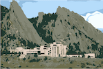

## Welcome to the development page of the NCAR Hackathons' website

For the website itself, go to: [ncar-hackathons.github.io](https://ncar-hackathons.github.io/).

Please address requests via [GitHub issue tracker](https://github.com/ncar-hackathons/ncar-hackathons.github.io/issues).

# Instructions for editing the website

## Editing the existing pages

When the site launched, it contained the following pages, which can all be edited for content or deleted: [`index.md`](./index.md) (the landing page), [`projects.md`](./projects.md), [`resources.md`](./resources.md), [`events.md`](./events.md).

## Editing the navigation menus and the footer section

The links in the menu and in the footer are all configured in the main configuration file, [`_config.yml`](./_config.yml). Specifically, the parameter `navbar-links` inside the file is used to define the top navigation menu, and the `author` parameter just below it is used to define the information that should be shown in the footer.

## How to edit the style of the website

The general layout of the pages can't be changed easily. But things like colour, spacing, fonts, and any other CSS style can easily be changed by adding CSS rules to the [`recon.css`](./css/recon.css) file. For example, you can change the size of the text, or the background colour of the navigation bar, or the colour of the text in the footer.

Note that the template was designed in a way such that it changes drastically when you view it on a big screen (laptop) vs a small screen (phone)

## How to add new pages

To add a new page at the URL `http://ncar-hackathons.github.io/example`:

- Add a file named `example.md` to the root directory of this repo
- The file **must** begin with two lines of three dashes (aka YAML front matter) in order for this new page to use the template. In other words, each file must begin with the following two lines

  ```
  ---
  ---
  ```

- You can write either in markdown or in pure HTML
- If you want to add images, I suggest you place all the images inside the [`img`](./img) folder and refer to images from there.
- In between the YAML front matter (between the two lines of dashes), you can specify a few parameters:
  - `title`: Gives a nice big title to the page
  - `subtitle`: A subtitle to the page
  - `bigimg`: The path to an image that will be used as a big wide "header image". This path has to point to a local file in this repository, it cannot point to an image on the web
  - You can see the [`projects`](./projects.md) page to see an example of using the `title` and `bigimg` parameters
- If you want to include a list of items on the page, where each item has an image, a short description, and some links, you need to define the items of the list in the YAML front matter and then include `` in the page wherever you want to show the list. Any images will automatically be cropped to be circular, and there wil be a maximum of 4 items per row. See the [`resources`](./resources.md) page for an example of how to include a nice list.

## How to add new blog posts

The pages described above should be added in the root directory. But any page you create inside the `_posts` folder will be treated as a blog post. The nice thing about blog post-type pages is that they will automatically be shown chronologically at `https://ncar-hackathons.github.io/blog/`, with all the pagination to previous/next posts taken care of.

Posts are created in exactly the same way as regular pages: you still need to make them `.md` file, they have to have YAML front matter, they can support the `title`/`subtitle`/`bigimg` parameters, you can add lists into them, etc. The only difference is that the name of the file must begin with the date of the post. For example, `2019-05-20-some-blog-post.md`. It's vital that the name of each post contain the date in such a format, followed by whatever name you want, followed by `.md`.
